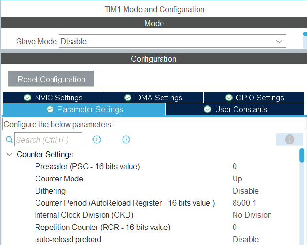
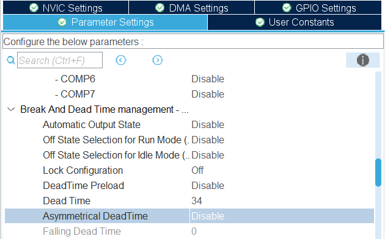
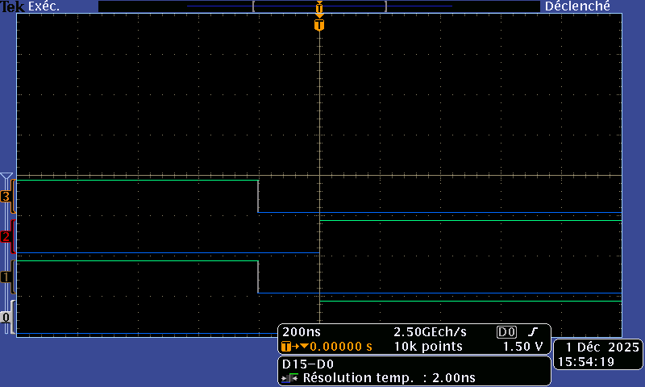
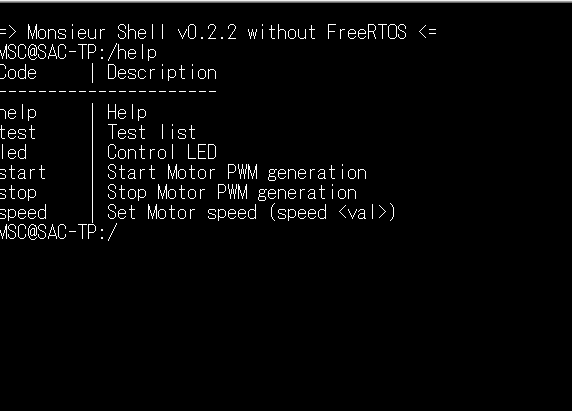

# 2526_ESE_AAA_SOLTANI_MENJLI
**Rédaction :Fakhri MENJLI ,Ezer SOLTANI**
## Commande MCC basique
### Objectifs :

- Générer 4 PWM en complémentaire décalée pour contrôler en boucle ouverte le moteur en respectant le cahier des charges.
- Inclure le temps mort,
- Vérifier les signaux de commande à l'oscilloscope,
- Prendre en main le hacheur,
- Faire un premier essai de commande moteur.

### Configuration: 

Le calcul du temp_mort:

> t_clk = 1/170MHZ = 5.88ns = 1 tic

>temp_mort= DTG * t_clk =200ns => DTG= 34
 ### Affichage sur l'oscilloscope:

 
## Implement Speed Control Function:

