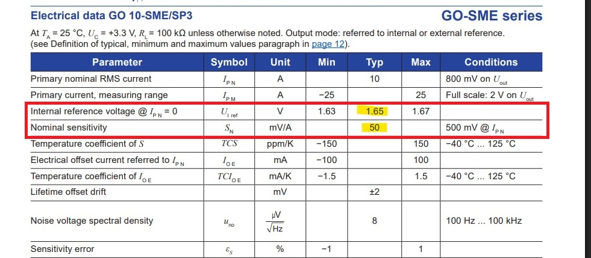
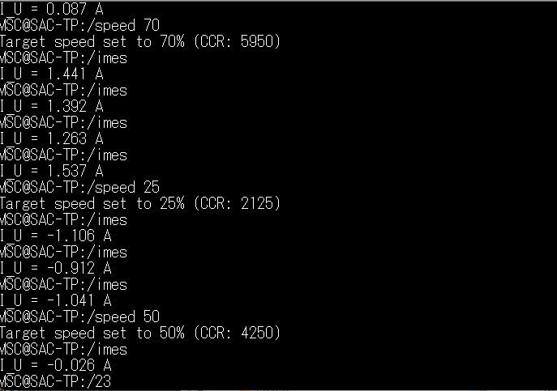
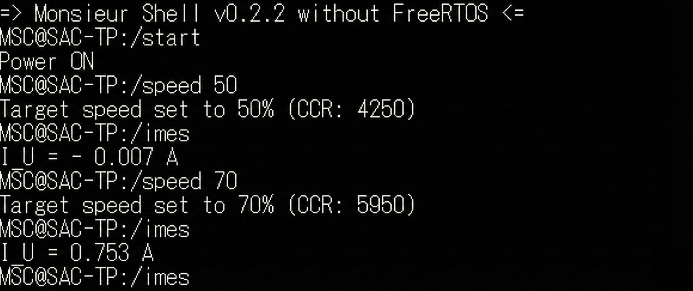

# 2526_ESE_AAA_SOLTANI_MENJLI
**Rédaction :Fakhri MENJLI ,Ezer SOLTANI**
## Commande MCC basique
### Objectifs :

- Générer 4 PWM en complémentaire décalée pour contrôler en boucle ouverte le moteur en respectant le cahier des charges.
- Inclure le temps mort,
- Vérifier les signaux de commande à l'oscilloscope,
- Prendre en main le hacheur,
- Faire un premier essai de commande moteur.

### Configuration: 


Le calcul du temp_mort:

> t_clk = 1/170MHz = 5.88ns = 1 tic

>temp_mort= DTG * t_clk =200ns => DTG= 34
 ### Affichage sur l'oscilloscope:


 
## Implimentation les fonctions de controle:


**speed 50%**


**speed 25%**


**speed 75%**


### Premier test avec un rapport cyclique de 75%


Remarque : Lors du passage direct de 50 % à 75 % de rapport cyclique, une montée brusque du régime moteur est observée. Cette variation soudaine peut engendrer des risques d’endommagement du moteur et de l’électronique de commande.

### Mesure de courant:
#### 1. Définir les courants à mesurer
  * Pour piloter une MCC avec un pont en H, le courant à mesurer en priorité est le courant moteur, car il est directement lié au couple et à la protection du moteur.
Dans notre montage, la MCC est branchée entre les phases U et V, donc :

𝐼u = −𝐼v
​
La mesure de 𝐼u est suffisante.

  * Le courant du bus continu I_bus peut aussi être mesuré pour la protection globale et la supervision de la puissance.
#### 2. Définir les fonctions de transfert des capteurs de courant
**DataSheet capteur du courant:**



**Fonction de transfert:**

* Capteur : V_out = V_off+ I * S
* Courant mesuré : I = (V_out - V_off)/S
* Conversion ADC : I = (((ADC/4095)*3.3) - V_off) / 0.05

**Broches STM32 utilisées:**

* Courant Phase U (Iu)

Pin : PA1

ADC : ADC1_IN2

Usage : mesure du courant moteur

* Courant Bus (I_bus)

Pin : PC2

ADC : ADC1_IN8

Usage : protection

**Première mesure avec ADC en Polling:**
* La fonction du traitement:
```c
float input_get_analog_u_current()
{
	HAL_ADCEx_Calibration_Start(&hadc1, ADC_SINGLE_ENDED); // Calibration
	    HAL_ADC_Start(&hadc1);
	    if (HAL_ADC_PollForConversion(&hadc1, HAL_MAX_DELAY) == HAL_OK)
	    {
	        adc_value = HAL_ADC_GetValue(&hadc1); // Lire la valeur brute
	        double voltage = (adc_value * VREF) / ADC_MAX_VALUE; 
	        double current = (voltage - 1.65) / SENSITIVITY;   
	        HAL_ADC_Stop(&hadc1);// Arrêt de l'ADC
	        return (float)current;
	    }
	    HAL_ADC_Stop(&hadc1); 
	    return 0.0f;
}
```
* Résultat sur terminal:



**deuxième mesure avec ADC en DMA:**
* La fonction du traitement:
```c
void input_analog_init(void)
{
    shell_add(&hshell1, "imes", cmd_imes, "Measure Phase U Current (A)");
    HAL_ADCEx_Calibration_Start(&hadc1, ADC_SINGLE_ENDED);
    if (HAL_ADC_Start_DMA(&hadc1, (uint32_t*)adc_buffer, 1) != HAL_OK)
    {
    }
}
```

* Résultat sur terminal:
  


