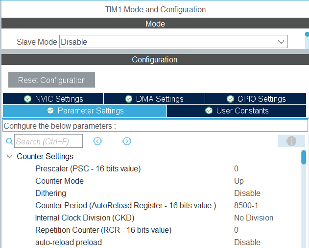
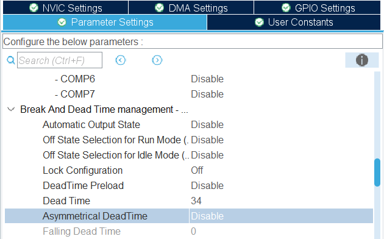
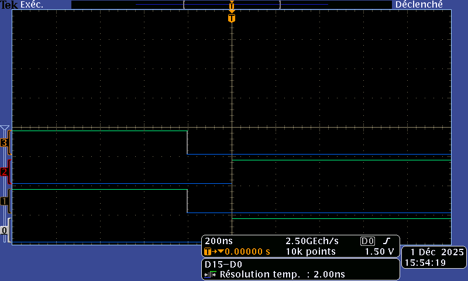
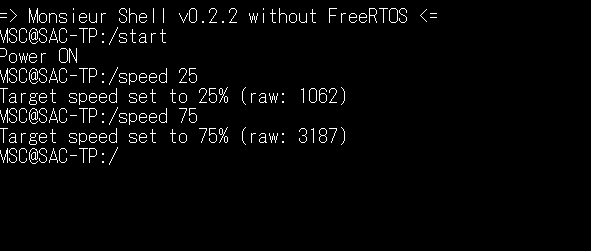
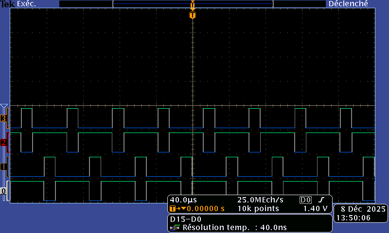
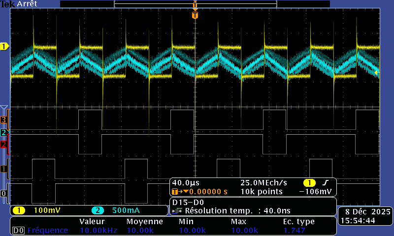

# 2526_ESE_AAA_SOLTANI_MENJLI
**Rédaction :Fakhri MENJLI ,Ezer SOLTANI**
## Commande MCC basique
### Objectifs :

- Générer 4 PWM en complémentaire décalée pour contrôler en boucle ouverte le moteur en respectant le cahier des charges.
- Inclure le temps mort,
- Vérifier les signaux de commande à l'oscilloscope,
- Prendre en main le hacheur,
- Faire un premier essai de commande moteur.

### Configuration: 

Le calcul du temp_mort:

> t_clk = 1/170MHz = 5.88ns = 1 tic

>temp_mort= DTG * t_clk =200ns => DTG= 34
 ### Affichage sur l'oscilloscope:

 
## Implimentation les fonctions de controle:

**speed 50%**

**speed 25%**

**speed 75%**

### Premier test avec un rapport cyclique de 75%

Remarque : Lors du passage direct de 50 % à 75 % de rapport cyclique, une montée brusque du régime moteur est observée. Cette variation soudaine peut engendrer des risques d’endommagement du moteur et de l’électronique de commande.

### Mesure de courant:

### Mesure de vitesse:

